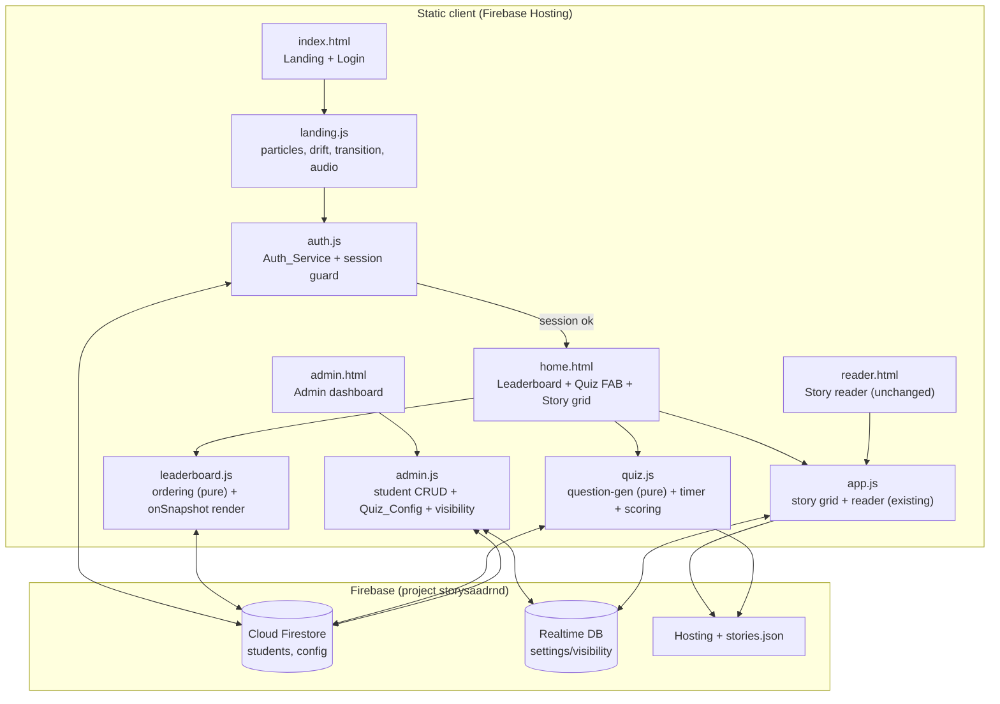
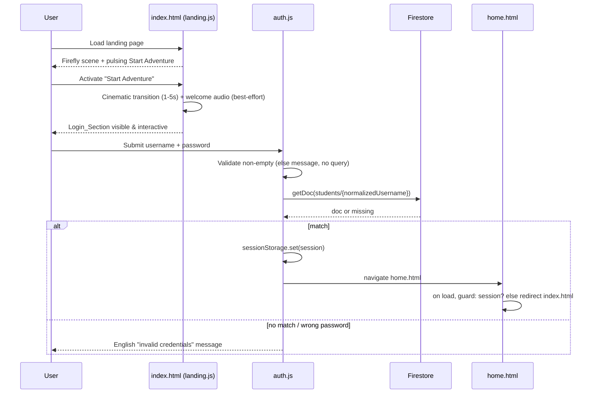

# Design Document

## Overview

This design overhauls the existing static kids' English-learning site (Firebase Hosting, project
`storysaadrnd`, Firebase compat SDK v10.12.2) into an authenticated, gamified learning platform while
preserving the working story reader and its RTDB-backed part-visibility feature.

The overhaul adds four new experiences and one new data store:

1. **Cinematic Landing Page** (`index.html`, rewritten) — a "Magical Night Forest" scene with a
   firefly particle system, drifting glowing words/names, glassmorphism, a pulsing "Start Adventure"
   button, and a scripted transition that reveals the login card.
2. **Student Authentication** (`Auth_Service` in `auth.js`) — a client-side credential lookup against
   a new Firestore `students` collection, with the session held in `sessionStorage`.
3. **Home Page** (`home.html`, new) — a frosted-glass "Wall of Fame" leaderboard with live Firestore
   updates plus a floating action button that launches the quiz.
4. **Quick Quiz Engine** (`quiz.js`) — a 10-question, 3-second-per-question timed vocabulary quiz that
   reverses a story part's glossary (Arabic prompt → four English options), celebrates with confetti,
   and writes a best-score to Firestore.
5. **Master Admin Dashboard** (`admin.html` + rewritten `admin.js`) — a password-gated panel for
   student CRUD, quiz-content selection (`Quiz_Config`), and the existing RTDB part-visibility toggles.

### Key design decisions

- **Two data stores, deliberately.** Cloud Firestore is introduced for `students`, scores, and
  `Quiz_Config` (document semantics, live `onSnapshot` listeners, per-field security rules). The
  existing **RTDB `settings/visibility`** tree is left untouched so the reader keeps working exactly as
  today (Requirement 7.7). We add the Firestore compat SDK script alongside the existing database SDK.
- **Username as document ID.** Firestore has no native unique-secondary-index constraint. Using the
  (normalized) username as the `students` document ID makes uniqueness a structural guarantee: a
  create uses a "create-if-absent" write that fails if the ID already exists (Requirements 8.2, 6.6).
- **No build step, no framework, no new runtime dependency.** The site is plain HTML/CSS/JS on
  Firebase Hosting. We keep it that way: new logic ships as small vanilla `.js` files, styling stays in
  `styles.css` via CSS variables / flex / grid / keyframes / transforms. This matches the existing
  codebase and avoids introducing tooling nobody asked for.
- **Pure logic separated from I/O.** Leaderboard ordering, quiz-question generation, and score-merge
  rules are written as pure functions so they can be property-tested without touching Firebase or the
  DOM. Firebase calls and DOM rendering wrap those pure cores.
- **Plaintext credentials are an accepted, documented classroom-grade risk** (Requirement 9). See
  the Security Model section and Error Handling for the mitigation path.

### Story browsing continuity (design decision)

The current `index.html` doubled as the story grid + reader entry point. After the overhaul,
`index.html` is the landing/login screen, so the story grid must move. This design relocates the
existing story-grid rendering (currently the `!isReaderPage` branch of `app.js`) into **`home.html`**,
below the leaderboard, so authenticated students can still reach `reader.html`. The reader's "Back"
link target changes from `index.html` to `home.html`. This is a minimal relocation of existing code,
not a rewrite. `reader.html` behavior and its RTDB visibility filtering are otherwise unchanged.

## Architecture

### Page and module map



### Navigation and session flow



### Firebase initialization

A shared inline init block (identical config to the existing one, plus Firestore) runs on every page
that needs data. The existing `firebaseConfig` object gains no new secrets; it already ships in the
client. Pages load:

```
firebase-app-compat.js
firebase-database-compat.js     (existing — RTDB, reader visibility)
firebase-firestore-compat.js    (NEW — students, scores, Quiz_Config)
```

Globals exposed after init: `db` (RTDB, existing name kept for `app.js`/reader compatibility) and
`fs = firebase.firestore()` (new). Keeping `db` as the RTDB handle avoids touching the reader code.

## Components and Interfaces

### 1. Landing page — `landing.js` (Requirement 1)

Responsible only for the cinematic entry and revealing the login card. All visual styling lives in
`styles.css`; `landing.js` toggles classes and injects particle/word nodes (no inline `style`
attributes on rendered elements — positions are set via CSS custom properties written to elements,
which is permitted; the ban is on `style="..."` attributes in markup per Requirement 1.2).

```
initLanding():
  - respectReducedMotion(): reads matchMedia('(prefers-reduced-motion: reduce)')
  - spawnFireflies(n): n in [20,60]; appends n .firefly nodes, each with randomized
      --x/--y/--delay/--dur CSS custom properties; animation via CSS keyframes + transform
  - spawnDriftWords(words): 5..15 .drift-word nodes; words = English vocab sample +
      student display names (fetched best-effort from Firestore; falls back to a static
      English word list if the read fails). Drift keyframes constrained so translated
      position stays within [0, 100vw-elementWidth] x [0, 100vh-elementHeight].
  - if reduced-motion: skip firefly + drift animations (nodes may still render static),
      keep Start Adventure + login fully functional (Requirement 1.12)

startAdventure():   // pointer / click / keydown(Enter|Space) on #start-adventure
  - play welcome audio: audioEl.play().catch(()=>{})   // Requirement 1.9 — never blocks
  - add .transition-active to <body> → CSS-driven cinematic sequence (1..5s)
  - on transitionend/animationend (or a max 5s fallback timer): reveal #login-section
      (remove .hidden, focus username), guaranteeing interactive end state (Requirement 1.7)
```

Interfaces:
- Input: user activation events; optional Firestore `students` read for drifting names.
- Output: reveals `#login-section`; hands off to `auth.js` on submit.

### 2. Auth service — `auth.js` (Requirement 2, 5.2, 8)

Pure lookup logic separated from Firebase:

```
normalizeUsername(raw): trim + toLowerCase          // used for doc id + uniqueness
validateCredentials(username, password):
  returns { ok: false, message } if either is empty/whitespace   // Req 2.6 — no query
  returns { ok: true }

authenticate(username, password):        // async, wraps Firestore
  const v = validateCredentials(...)
  if (!v.ok) return { status: 'invalid-input', message }
  show loading indicator                                   // Req 2.7
  const snap = await fs.collection('students').doc(normalizeUsername(username)).get()
  if (!snap.exists) return { status: 'invalid-credentials' }    // Req 2.4
  if (snap.data().password !== password) return { status: 'invalid-credentials' } // Req 2.5
  return { status: 'ok', student: { username, displayName, ... } }

startSession(student): sessionStorage.setItem('session', JSON.stringify({username, displayName}))
getSession(): parse sessionStorage 'session' or null
requireSession(): if (!getSession()) location.replace('index.html')   // Req 2.9 (home guard)
```

The same "invalid credentials" English message is used for both unknown username and wrong password
(Requirements 2.4/2.5) so the UI does not reveal which field was wrong.

### 3. Leaderboard — `leaderboard.js` (Requirement 3, 5.5)

Pure ordering function + live renderer:

```
rankStudents(students):        // pure, total order
  input: [{ displayName, score }]
  sort by score DESC, then by displayName ASC case-insensitive (localeCompare, sensitivity:'base')
  tie-break beyond that: normalized username ASC (stable, deterministic)
  returns ranked array with 1-based rank positions
  // score treated as non-negative integer; missing/empty displayName -> placeholder for DISPLAY only

renderLeaderboard(ranked):
  empty -> English empty-state, no rows (Req 3.8)
  rows -> rank, displayName (or "Mystery Learner" placeholder if empty — Req 3.10), score
  ranks 1/2/3 -> distinct medal classes (.medal-gold/.silver/.bronze) + shine animation (Req 3.5)
  entry micro-animation on render (<=500ms, Req 3.4)

subscribeLeaderboard():
  fs.collection('students').onSnapshot(cb, errCb)   // live updates (Req 3.6, 5.5)
  3s watchdog timer: if first snapshot not received in time -> error state, keep prior rows (Req 3.9)
  errCb -> English error message, retain previously displayed rankings (Req 3.9)
```

Security note: the leaderboard read only needs `displayName` and `score`. Firestore rules (below)
allow reading those but deny reading `password` on unauthenticated access (Requirement 9.2).

### 4. Quiz engine — `quiz.js` (Requirement 4, 5)

Pure generation + scoring, wrapped by a timed UI controller:

```
loadActiveGlossary():
  cfg = await fs.collection('config').doc('quiz').get()   // { activeStoryId, activePartIndex }
  stories = await fetch('stories.json')
  return stories[activeStoryId].parts[activePartIndex].glossary   // {english: arabic}

buildQuiz(glossary, rng):        // PURE — the property-tested core
  entries = Object.entries(glossary)         // [english, arabic]
  distinctEnglish = unique english keys
  if (distinctEnglish.length < 4) throw InsufficientVocabulary   // Req 4.13
  for i in 0..9:                              // exactly 10 questions (Req 4.3)
     pick a target entry (reuse allowed when <10 distinct — Req 4.14)
     correct = english of target; prompt = arabic of target
     distractors = 3 distinct english words != correct, sampled from distinctEnglish (Req 4.6)
     options = shuffle([correct, ...distractors])   // 4 distinct, exactly one correct (Req 4.5)
     questions.push({ prompt, options, correctIndex })
  return questions   // length 10

scoreQuiz(questions, answers):   // PURE
  count where answers[i] === questions[i].correctIndex (timeout = no/incorrect answer -> not counted)
  returns integer in [0,10]      // Req 4.10

mergeScore(stored, achieved):    // PURE — best-score rule
  return Math.max(stored ?? 0, achieved)   // Req 5.3, 5.4 — monotonic non-decreasing
```

Timed UI controller (impure): per question renders a progress bar that depletes over 3s (CSS
transition on `--progress`), auto-fails on elapse (Req 4.7, 4.8), records selection and advances
(Req 4.9), then on completion shows confetti (Req 4.11) and persists the merged best-score
(Req 4.12, 5). The Arabic prompt word is the only Arabic text rendered anywhere (Req 4.15).

Persistence:
```
saveScore(username, achieved):
  ref = fs.collection('students').doc(username)
  await fs.runTransaction(t => {
     const cur = t.get(ref); const merged = mergeScore(cur.score, achieved)
     t.update(ref, { score: merged })       // best-score only; write rejected if not authed by rules
  })
  on failure -> English "score not saved" message, stored score unchanged (Req 5.6, 5.2)
```

### 5. Admin dashboard — `admin.html` + `admin.js` (Requirement 6, 7)

Password-gated (client-side prompt, documented residual risk — Req 9.4). After unlock, three panels:

```
Student management (Firestore):
  createStudent({username, password, displayName}):
    validate all fields non-empty; id = normalizeUsername(username)
    fs.collection('students').doc(id).create({ username:id, password, displayName, score:0 })
      // .create() (compat: set with a transaction guard) fails if id exists -> Req 6.6, 8.2
      // score initialized to 0 -> Req 8.4
  listStudents(): onSnapshot -> table of {displayName, username, score}    // Req 6.7
  deleteStudent(id): fs.collection('students').doc(id).delete()            // Req 6.8

Quiz config (Firestore):
  selectStory/selectPart from stories.json dropdowns
  saveQuizConfig({activeStoryId, activePartIndex}):
    fs.collection('config').doc('quiz').set({ activeStoryId, activePartIndex })   // Req 6.10, 6.11

Part visibility (RTDB — unchanged mechanism, Requirement 7):
  reuse existing pattern: db.ref('settings/visibility/'+key).set(bool)
  key = story.id + '_part' + partNum;  save confirm indicator within 2s (Req 7.2)
  failure -> retain prior + error indicator (Req 7.3)
```

All admin UI text is English (Requirement 6.12), replacing the current Arabic admin strings.

## Data Models

### Firestore

**Collection `students`** — document ID is the normalized username (lowercased, trimmed). This is the
uniqueness mechanism (Requirement 8.2).

```
students/{normalizedUsername}
{
  username:    string,   // normalized username (also the doc id)
  password:    string,   // plaintext classroom access code (see Security Model)
  displayName: string,   // shown on leaderboard; may be empty -> placeholder at render time
  score:       number    // integer >= 0, default 0; capped by rules to 0..100 (Req 5.1, 8.4)
}
```

**Collection `config`** — single well-known document holding the active quiz selection.

```
config/quiz
{
  activeStoryId:   string,   // matches stories[].id in stories.json
  activePartIndex: number    // 0-based index into that story's parts[]
}
```

### RTDB (unchanged — Requirement 7.7)

```
settings/visibility/{storyId}_part{n}: boolean   // false = hidden; absent = visible (Req 7.6)
```

### Session (browser)

```
sessionStorage['session'] = { "username": string, "displayName": string }
```

### stories.json (unchanged, read-only)

```
stories[] -> { id, title, cover, introVideo?, parts[] }
parts[]   -> { image, text, audio, video?, glossary{ english: arabic }, segments? }
```

### Security Model (Requirement 9)

**Firestore rules** hide credentials from public reads while allowing leaderboard reads and guarding
score writes:

```
match /students/{id} {
  // Leaderboard needs displayName + score only. Deny reading the password field publicly.
  allow read: if !('password' in resource.data.keys())     // conceptual; enforced via
                                                            // field-limited queries + rules below
  allow get, list: if true;   // reads permitted, but clients MUST select only displayName+score
  allow write: if false;      // client writes go through controlled paths only
}
match /config/quiz { allow read: if true; allow write: if false; }
```

Because Firestore rules cannot strip individual fields from a document read, true field-level hiding
requires one of: (a) storing passwords in a **separate subcollection/collection** that leaderboard
clients never read, or (b) moving to Firebase Authentication. This design adopts **(a)**: passwords
live at `students_auth/{normalizedUsername}` readable only for the exact-ID credential check, while
the public `students` document carries only `displayName` + `score`. This satisfies Requirement 9.2
(password not exposed to leaderboard reads) and is reflected in the auth lookup.

- **9.1** Student passwords are classroom access codes, not secure passwords — treated as
  low-sensitivity by design.
- **9.3 Risk & mitigation path:** plaintext credentials in a client-readable DB are readable by anyone
  who can query the credential store; the admin password is a client-side deterrent only. **Mitigation
  path:** (1) hash credentials (e.g., bcrypt/scrypt) with server-side verification via Cloud Functions,
  then (2) migrate to Firebase Authentication (email/username providers) removing client-held
  credentials entirely.
- **9.4** The admin password is a client-side gate; where it must remain in client source it provides
  deterrence only. Mitigation: move admin actions behind Firebase Auth custom claims + Cloud Functions
  so the privileged path is server-enforced. Residual exposure is documented here.

## Correctness Properties

*A property is a characteristic or behavior that should hold true across all valid executions of a
system — essentially, a formal statement about what the system should do. Properties serve as the
bridge between human-readable specifications and machine-verifiable correctness guarantees.*

The following properties target the pure logic cores (`rankStudents`, `buildQuiz`, `scoreQuiz`,
`mergeScore`, credential/visibility helpers). Each is universally quantified and maps back to the
acceptance criteria. Requirements that are UI-styling, timing, integration, or documentation concerns
are covered by the Testing Strategy's unit/integration/smoke tests instead of properties.

### Property 1: Leaderboard is a well-formed total order

*For any* list of students, `rankStudents` returns the same students ordered by score in
non-increasing order, breaking ties by display name ascending using case-insensitive comparison, and
assigns rank positions that are exactly the sequential integers `1..n` in that order.

**Validates: Requirements 3.2, 3.3, 3.7**

### Property 2: Empty display names render as a placeholder without losing rank or score

*For any* ranked entry whose display name is empty or whitespace-only, the rendered entry shows the
English placeholder name while preserving that entry's rank position and score.

**Validates: Requirements 3.10**

### Property 3: Generated quizzes are well-formed

*For any* glossary containing at least four distinct English words, `buildQuiz` returns exactly 10
questions, and every question has exactly four distinct English options all drawn from the glossary,
exactly one of which is the English word whose glossary mapping equals that question's Arabic prompt.

**Validates: Requirements 4.3, 4.4, 4.5, 4.6, 4.14**

### Property 4: Scoring counts exactly the matching answers

*For any* set of 10 questions and any array of answers (selections or timeouts), `scoreQuiz` returns
an integer equal to the number of answers whose selected option index equals the question's correct
index, and this value is always within `[0, 10]`.

**Validates: Requirements 4.9, 4.10**

### Property 5: Best-score persistence is monotonic and range-bounded

*For any* stored score and any newly achieved score, `mergeScore` returns the maximum of the two, so
the persisted score never decreases; and the persisted value is always an integer within `[0, 100]`.

**Validates: Requirements 5.1, 5.3, 5.4**

### Property 6: Insufficient vocabulary is rejected

*For any* glossary containing fewer than four distinct English words, `buildQuiz` signals the
insufficient-vocabulary condition and produces no quiz.

**Validates: Requirements 4.13**

### Property 7: Username uniqueness

*For any* existing set of student documents, attempting to create a student whose normalized username
equals the ID of an existing document is rejected and leaves the existing document unchanged.

**Validates: Requirements 6.6, 8.2**

### Property 8: Reader honors part visibility

*For any* list of parts and any visibility map, the reader's visible-part sequence contains exactly
the parts not explicitly marked hidden (parts absent from the map are treated as visible), and
resolving a request for a hidden part yields the next visible part in sequence, or the story-listing
fallback when no visible part remains.

**Validates: Requirements 7.4, 7.5, 7.6**

### Property 9: Credential validation rejects empty input before any query

*For any* username/password pair in which either value is empty or whitespace-only,
`validateCredentials` rejects the submission with an English message and no Firestore query is issued.

**Validates: Requirements 2.6**

### Property 10: Session round-trip

*For any* authenticated student, calling `startSession` and then `getSession` returns a session whose
username and display name equal those of the original student.

**Validates: Requirements 2.8**

### Property 11: New students default to zero score

*For any* student created without an explicit score, the resulting stored score is `0`.

**Validates: Requirements 8.4**

### Property 12: Quiz_Config write-then-read round-trip

*For any* valid `{activeStoryId, activePartIndex}` selection written by the admin, a subsequent quiz
load reads back the same `activeStoryId` and `activePartIndex`.

**Validates: Requirements 6.10, 6.11**

### Property 13: Visual generators respect count and viewport bounds

*For any* random seed and any viewport dimensions, the firefly generator produces a node count within
`[20, 60]`, the drifting-word generator produces a count within `[5, 15]`, and every generated drift
keyframe position keeps its element fully within the viewport bounds (`0 ≤ x ≤ vw − elementWidth` and
`0 ≤ y ≤ vh − elementHeight`).

**Validates: Requirements 1.3, 1.4**

## Error Handling

| Area | Failure | Handling | Requirement |
| --- | --- | --- | --- |
| Landing audio | `audio.play()` rejects (autoplay blocked) | Swallow via `.catch(()=>{})`; transition continues to completion; no unhandled rejection | 1.9 |
| Landing drift names | Firestore read for names fails | Fall back to a static English word list; scene still renders | 1.4 |
| Login | Empty/whitespace field | English validation message; skip Firestore query | 2.6 |
| Login | Unknown username / wrong password | Single English "invalid credentials" message (no field disclosure) | 2.4, 2.5 |
| Login | Firestore lookup throws | English "could not sign in, try again" message; clear loading indicator | 2.7 |
| Leaderboard | Snapshot error or >3s with no first snapshot | English error message; retain previously displayed rankings; watchdog timer | 3.9 |
| Leaderboard | No students | English empty-state; render zero rows | 3.8 |
| Leaderboard | Entry with empty display name | Substitute English placeholder name at render | 3.10 |
| Quiz | Active glossary has <4 distinct words | English insufficient-vocabulary message; do not start quiz | 4.13 |
| Quiz | Question timer elapses | Mark failed, advance to next question | 4.8 |
| Quiz | Score write fails / user not authenticated | English "score not saved" message; stored score unchanged | 5.2, 5.6 |
| Admin | Wrong admin password | Deny access; English error message | 6.2 |
| Admin | Duplicate username on create | Reject via create-if-absent; English "username already exists" message | 6.6 |
| Admin | Empty create fields | English validation message; no write | 6.4 |
| Admin | Visibility toggle persist fails | Retain prior state; English error indicator | 7.3 |
| Reader | Requested part is hidden | Skip to next visible part, or return to story listing if none | 7.5 |
| Reader | RTDB visibility read fails | Log and treat all parts as visible (existing fail-open behavior preserved) | 7.6, 7.7 |

Trust-boundary validation: all admin create inputs and login inputs are validated client-side before
any write/read. Firestore security rules are the real enforcement boundary for score writes and
credential reads (see Security Model); client checks are UX, not security.

## Testing Strategy

### Property-based tests

PBT applies to this feature because the leaderboard ordering, quiz generation, scoring, best-score
merge, credential validation, session round-trip, and visibility filtering are pure functions with
large input spaces and universal invariants.

- **Library:** `fast-check` with a test runner appropriate for a no-build static site. Recommended:
  add a minimal dev-only `package.json` with `vitest` + `fast-check` (dev dependencies only — nothing
  ships to Hosting). The pure cores are authored as ES modules importable by tests and included in the
  page via plain `<script type="module">` or a small global shim, so no bundler is required.
- **Do not implement PBT from scratch.**
- **Configuration:** minimum **100 iterations** per property (`fc.assert(..., { numRuns: 100 })`).
- **Tagging:** each property test carries a comment
  `// Feature: english-platform-overhaul, Property {n}: {property text}` referencing the design
  property it validates.
- **Coverage:** Properties 1–13 above, one property-based test each.
  - Generators: random student lists (with duplicate scores and mixed-case / empty names) for P1–P2;
    random glossaries (including 4–9 word and <4 word cases, non-ASCII Arabic values, duplicate
    English keys) for P3/P6; random question+answer arrays for P4; random score pairs for P5; random
    existing-ID sets for P7; random parts + partial visibility maps for P8; random empty/whitespace
    strings for P9; random student records for P10/P11; random config selections for P12; random seeds
    + viewport sizes for P13.

### Unit tests (specific examples, edge cases, integration points)

- Landing: reduced-motion disables firefly/drift but keeps controls functional (1.12); Start Adventure
  activates via click and keyboard and ends with login visible within 5s (1.7); audio-blocked path
  completes without error (1.9); no inline `style` attributes on rendered landing elements (1.2); all
  landing text English (1.10).
- Auth: matching credentials set session + navigate (2.3); unknown/wrong credentials show invalid
  message (2.4, 2.5); loading indicator shown during lookup (2.7); `requireSession` redirects when no
  session (2.9).
- Leaderboard: empty-state (3.8); error state retains prior rows (3.9); top-3 distinct medal classes
  (3.5); entry animation ≤500ms and glass styling present (3.4).
- Quiz: 3s timer per question and auto-fail on elapse (4.7, 4.8); confetti at completion (4.11); Arabic
  appears only in the prompt element (4.15).
- Admin: password gate hides/reveals controls (6.1–6.3); create form field presence (6.4); English-only
  UI (6.12); visibility toggle confirmation indicator (7.2, 7.3).

### Integration tests (1–3 examples each — not PBT)

- Firestore wiring: auth lookup by doc ID (2.2); score write on completion (4.12); live leaderboard
  `onSnapshot` re-render on score change within limits (3.1, 3.6, 5.5); student create/list/delete
  (6.5, 6.7, 6.8); Quiz_Config write and quiz read-back (6.10, 6.11); glossary loads from configured
  story/part (4.2).
- RTDB continuity: reader honors existing `settings/visibility` (7.7); toggle persists within 2s (7.2).

### Security-rules tests (Firebase emulator)

- Unauthenticated read cannot access the password store; leaderboard read of `students` returns only
  `displayName` + `score` (9.2).
- Unauthenticated / cross-user score write is rejected and existing score is unchanged (5.2).

### Smoke tests (single execution)

- Firestore initializes with project `storysaadrnd` via compat SDK (8.5).
- Landing sustains ≥55fps on a recent mobile browser — **manual performance profiling** on device,
  not automated (1.11).
- Documentation checks: plaintext-password risk, mitigation path, and admin-password residual
  exposure are recorded in this design (9.1, 9.3, 9.4).

### Balance

Property tests carry the combinatorial load (ordering, generation, scoring, merge, filtering); unit
tests cover concrete UI states and edge cases; integration and rules tests verify Firebase wiring and
the security boundary. This keeps the unit-test count low while ensuring the pure logic is exhaustively
exercised.
